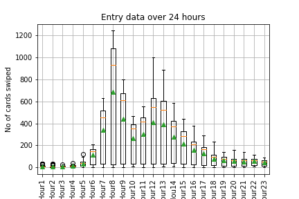

# Building_Utilization
The task was to analyze the key card swipe data of over a million rows to predict the occupancy of the space by the hour. This information would enable to create "Smart buildings" by efficient use of HVAC, lighting and other resourses 

First, we worked with smaller subset of dummy data, an excel sheet that lists each of the tenant user's entry and exit in the building. 3 disparate tables, approximately 1000 rows, consisting of building occupant information consisting of: Company Name, KeyCard ID, Time of Entry, Time of Exit, Point of Entry, etc. 

We used sample data to develop and train machine learning model to find occupancy rate by hour.

We used Matplotlib to create box plots for each hour of the day to better understand the data and distribution of data. Used Tableau to visualize the card swipes trend by tenant.

Used various machine learning models like linear regression, KNN and Random Forest Regression to find best possible fit. We got best R2 value of 0.98 using Random Forest Regression and were able to predict number of card swipes for next hour.
